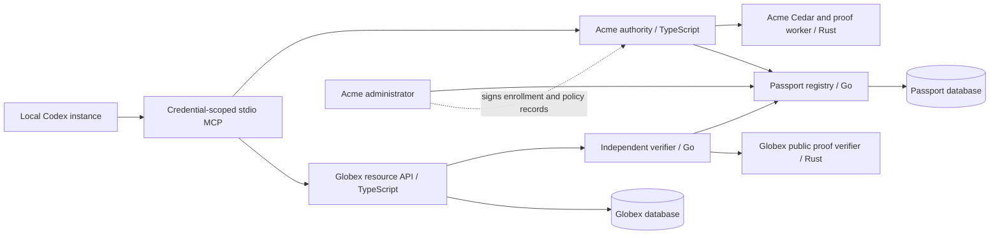

# Architecture

Both databases share one local PostgreSQL cluster but use separate owners and passwords. Neither database contains private keys or private policy witnesses. The application's transactions are separate from registry transactions.

## Component boundaries

| Service        | Private material mounted                                                                                               | Responsibility                                                                                                     |
| -------------- | ---------------------------------------------------------------------------------------------------------------------- | ------------------------------------------------------------------------------------------------------------------ |
| `registry`     | Registry state-signing key; scoped admin credential hashes are **not** implemented (local bearer values are in a file) | Validate signed administrative mutations; maintain public records, revocation, policy pointer, receipts and outbox |
| `authority`    | Acme policy-signing key, Acme admin token, private limit and commitment blinding                                       | Verify runtime authority, evaluate Cedar, generate optional proof, sign capability, persist authorization receipt  |
| `acme-worker`  | None at rest; receives witnesses from Acme over its private Compose connection                                         | Cedar evaluation, commitment generation and proving                                                                |
| `verifier`     | None; only public pins                                                                                                 | Run `pkg/verifier` and resolve signed fresh registry state                                                         |
| `globex-proof` | None                                                                                                                   | Verify public proof inputs; its mode disables commit/prove/decide endpoints                                        |
| `globex`       | Globex development root used for receipts; its own DB credential                                                       | Issue challenges, invoke its verifier, enforce local rules, atomically execute and audit                           |
| `agent`        | Exactly one runtime profile                                                                                            | Sign requests and invoke Acme/Globex; no administrative tools                                                      |
| `toolbox`      | Developer administration material                                                                                      | Explicit operator bootstrap, enrollment, demo and maintenance commands                                             |

Registry and verifier use the same binary in different modes. The Globex verifier mounts no registry signing key and no Acme secret. Compromising Passport's capability to issue a verification _response_ cannot bypass Globex: Globex executes against its own verifier process.

## Persistence and atomicity

Registry mutations lock the organization row and atomically write an immutable signed record and an outbox event. Policy activation compares the signed predecessor and next numeric version under that lock. Records are retained after revocation; an old identifier cannot be reinserted to reactivate it. The registry's outbox supports a per-organization cursor feed. It is durable, but an external message publisher/acknowledgment system is deferred.

Globex consumes a challenge only after cryptographic verification and its own acceptance rules. A conditional PostgreSQL update checks both nonce and verification expiry using database time. In the same transaction it inserts the simulated execution, signed execution receipt and outbox event. Rollback preserves the nonce on a failed transaction. Unique nonce and capability constraints provide defense in depth. Competing requests wait for the same database row; one succeeds.

This atomic boundary includes only a local simulation. A network call, actual payment or another service's side effect would need a reservation/idempotency/reconciliation protocol.

## Developer paths

- Native code checks need Node.js, Go and Rust. Runtime services and their dependencies build in containers.
- Compose watch rebuilds service images; dashboard assets are bind-mounted.
- `scripts/configure.mjs` generates ignored development credentials without npm dependencies.
- `scripts/bootstrap.ts` registers the public objects and enrolls the default runtime.
- `scripts/admin.ts` is intentionally an operator tool, separate from MCP tool code.
- `scripts/demo.ts` acts as multiple runtimes and includes privileged test mutations to exercise invalid signatures and stale signed authority. Those test capabilities are not available through MCP.

The current Go module name is a local placeholder, `github.com/passport-local/atlas`. No Go module or npm SDK has been published to an external registry. Choose the permanent namespace and release process before external distribution.
