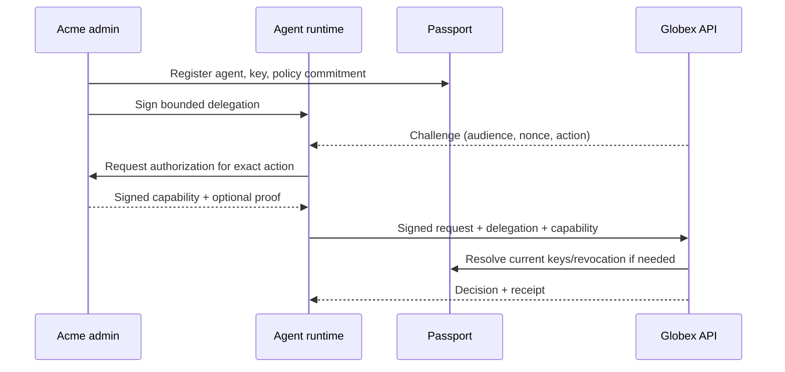

# Passport: agent identity and private authority proof of concept

**Status:** implementation handoff draft · **Date:** 2026-09-24 · **Owner:** founder / technical lead

## 1. Product thesis

Passport lets an independently operated agent prove **who controls it, that its current runtime may act, and that a particular action is authorized** to a counterparty outside its organization. The counterparty should be able to verify the answer without receiving the organization's complete internal policy. A later payment adapter can connect that decision to an x402 payment.

The distinctive use case is cross-organization trust. An enterprise identity provider can govern its own agents; Passport's test is whether Acme's agent can present an independently verifiable authorization to Globex without both parties joining the same identity system. The protocol and verification format should be portable. No blockchain is required for routine verification.

**Proof-of-concept question:** Can two separate organizations complete a request in which the receiving organization verifies the caller's organizational binding, runtime key, delegation, fresh authorization and exact action, with a reproducible audit trail? Can a narrowly defined private predicate hide a policy value while preserving that verification?

## 2. Success criteria and scope

One runnable demonstration must show:

1. Acme registers an organization signing key and an agent, binds a runtime public key, and signs a bounded delegation.
2. The agent signs a request to Globex for a specific resource and action. Globex verifies the chain of authority, key status, audience, request body, time window and replay nonce using a documented verifier interface.
3. Acme evaluates a purchase policy and issues a short-lived, request-bound authorization. A verifier can detect an altered amount, recipient, resource, policy version or signature.
4. Key/delegation revocation and policy update cause new verification attempts to fail or require a new authorization, subject to a documented freshness bound.
5. An optional ZK path proves one private predicate, such as `public_amount <= private_per_transaction_limit`, bound to an Acme-signed active policy commitment. The verifier sees the amount and pass result, but not the limit. A failing proof or stale commitment is rejected.
6. Tests and a scripted demo exercise positive, negative, replay, expiry and revocation cases. A second organization can run the verifier from the published contract without private Acme secrets.

**POC boundary:** Real money, escrow, wallet custody, public-chain registry, marketplace, global reputation graph, general-purpose ZK policy compiler, multi-chain routing and production compliance are outside this first milestone. A simulated x402 purchase or testnet-only adapter is a follow-on integration, never a prerequisite for the trust demo. Do not present test keys or a simulated policy result as production security.

## 3. Actors and trust model

| Actor | Controls | Trust granted to it |
| --- | --- | --- |
| Acme administrator | Organization root key, agent registration, policy versions, delegation and revocation | Authoritative for Acme's own permissions; cannot assert Globex's acceptance rules |
| Acme agent runtime | Short-lived/runtime private key; signed request | Can act only within its signed delegation and live authorization |
| Passport service | Registry, verification, receipts, optional hosted policy/prover | Distributes state and verifies evidence; must not be able to silently mint an Acme authorization |
| Globex resource server | Resource, accepted issuers, minimum assurance, nonce store | Makes the final local allow/deny decision; rejects even a valid Acme proof if Globex rules do not permit the action |

The operator's signature proves that *Acme authorized according to an Acme-controlled policy*. It is not a guarantee that the merchant, bank or regulator accepts the action. A ZK proof proves a statement about authenticated inputs and an identified program; signatures, commitments and source attestations establish who supplied those inputs. Proof validity alone does not establish their truth.

## 4. Request and verification flow

**Verification order at Globex:** validate issuer trust configuration; verify organization and delegation signatures; verify runtime proof of possession on the canonical request; check audience, nonce, timestamps and bounded scope; resolve key/delegation/policy state with a defined freshness policy; verify capability signature and optional proof against the active commitment; apply Globex's own rules; atomically consume the nonce; execute once; record the decision. Default deny on missing, inconsistent or unverifiable evidence. Specify a fail-closed policy for registry outages in the POC.

Acme's authorization component signs the capability with an Acme-controlled, root-delegated policy-signing key. If Passport hosts that component, its signing authority must be explicitly delegated, narrowly scoped and revocable; record that increased trust in the threat model. Bind every capability to `issuer_org`, `agent_id`, `runtime_key_id`, `action`, `resource`, `counterparty/audience`, `amount_minor_units` and `currency` if financial, `request_digest`, `nonce`, `issued_at`, `expires_at`, `policy_version`, and a unique `capability_id`. Canonical serialization and signature algorithm identifiers must be versioned and test-vector backed. Never authorize using a free-floating Boolean `satisfied: true`.

For amounts, use integer minor units plus asset/network identifier; reject ambiguous decimal or unit conversion. Distinguish an **authorization receipt** from an **execution/payment receipt**. For cumulative spending, a static proof of `remaining >= amount` is insufficient: concurrent calls can overspend. Reserve budget atomically at the authoritative ledger, give the reservation a short expiry, and reconcile on execution or cancellation before claiming budget safety. This can be a later milestone if the POC tests only per-transaction limits.

## 5. Data and API contract (draft v0)

| Object | Required fields / behavior |
| --- | --- |
| Organization | Stable ID, trusted root public key(s), signing algorithm, key rotation history |
| Agent | Stable ID, organization ID, status, metadata limited to what is needed |
| Runtime key | Public key, purpose, validity window, parent delegation, revocation state |
| Delegation | Issuer and subject IDs, allowed actions/resources, audience, expiry, signature, revocation ID |
| Policy version | Organization signature, canonical commitment, effective interval, predecessor/version, status |
| Capability | Exact-request binding described above, signature, proof descriptor if present |
| Receipt | Decision, request/capability IDs, verifier, timestamps, policy version, evidence digests; omit hidden policy data |

Suggested external operations: `POST /v0/agents`, `POST /v0/agents/{id}/keys`, `POST /v0/delegations`, `POST /v0/policies`, `POST /v0/capabilities`, `POST /v0/verify`, and revocation endpoints. `GET /v0/organizations/{id}/trust` publishes the public verification bundle. Authentication and authorization for *administrative* endpoints require their own explicit mechanism; agent signatures alone do not grant admin rights. Use an OpenAPI or protobuf contract with generated clients and explicit error codes (`invalid_signature`, `expired`, `revoked`, `replay`, `policy_mismatch`, `untrusted_issuer`, `denied`). Endpoint paths may change to match the local plan; semantics must remain.

## 6. Private policy proof experiment

The first proof statement should be deliberately narrow:

> Given public `(amount, agent_id, audience, request_digest, policy_commitment, policy_version, expiry)` and private `(limit, commitment randomness, signed policy material)`, prove that the identified Acme policy commits to `limit`, that Acme authorized that commitment, and `amount <= limit` for this exact request.

The verifier must know the proof program/verifying key or immutable program digest, accept Acme's current signed policy commitment, validate expiry and revocation, and verify the proof's public inputs. Keep the policy structure/predicate type public in this experiment; hide the numeric limit. Hiding the *entire policy program* is a different, harder problem and must not be claimed by this proof. A plain commitment may leak a low-entropy limit through guessing; use a hiding commitment with adequate randomness and test the construction. A timestamp inside a proof cannot by itself establish live revocation; the verifier needs a fresh trusted state source or a sufficiently short, explicit validity bound.

Normal authorization can use Cedar for administrator-readable policy decisions, but there is no assumed general Cedar-to-ZK compiler. The ZK predicate is a separate, reviewed statement with a conformance test against the relevant Cedar decision. Do not let the prover select an easier program, stale commitment or arbitrary self-signed policy. Benchmark proof generation time, verification time and proof size; if these are unsuitable for synchronous requests, use asynchronous precomputation or leave this feature behind a feature flag. A conventional signed capability remains the baseline.

## 7. Implementation defaults and boundaries

| Layer | Default for this experiment | Reason / decision gate |
| --- | --- | --- |
| Control API and verifier | Go; HTTP/JSON external contract | Small deployable service with clear packages and portable verifier |
| Persistence | PostgreSQL with migrations and transactional outbox | Consistent registration/revocation/receipts; no broker required for local demo |
| Policy | Cedar library behind a policy interface | Explicit allow/deny semantics; do not equate a Cedar decision with a ZK proof |
| Proof worker | Rust, isolated behind versioned `Prove/Verify` contract | Choose circuit or zkVM only after predicate and benchmarks are fixed |
| SDK/demo | TypeScript agent and Globex server | Demonstrates an outside-party integration |
| Keys | Local ephemeral dev keys; production design for customer-controlled keys and AWS KMS/HSM-backed platform keys | Private keys never stored in the database or request logs; pin exact algorithms per key type |
| AWS target | ECS Fargate, RDS PostgreSQL, KMS, SQS/outbox, CloudWatch/OpenTelemetry | Deployment comes after the local deterministic demo; Terraform as a later reproducible target |

One repository and one main deployment are sufficient initially. Packages should separate registry, request verification, delegation, policy, proofs and receipts. Publish verification logic as a portable library if the architecture permits. A verifier that always calls Passport is easier to prototype; the contract must state its online dependency and outage behavior. Future offline verification requires signed state snapshots and bounded revocation staleness.

Use established cryptographic encodings and libraries. Specify one key/signature profile for the POC (for example Ed25519 for organization/runtime signatures) and keep EVM wallet signatures separate. AWS KMS algorithm availability and wire-format compatibility must be checked before substituting it for local keys. Runtime certificates or SPIFFE federation can follow once the enrollment threat model is clear; avoid a permanent shared API token for every agent.

## 8. Swarm work packages

**Integration lead (starts first; owns contracts and merge):** compare this brief with the founder's local plan; record decisions and unresolved conflicts in `docs/decisions.md`; define threat model, exact demo transaction, JSON schemas, canonical signing format, test vectors and acceptance tests. Own CI and final end-to-end demo. No subteam changes shared schemas without lead review.

| Workstream | Deliverable | Dependency / merge gate |
| --- | --- | --- |
| A. Registry and trust | Organization/agent/key/delegation schema, admin endpoints, signed trust bundle, revocation and rotation | Contract/test vectors; migration and negative tests |
| B. Verifier and SDK | Independent verification package, nonce handling, signed-request helper, Globex demo API | Contract and trust-bundle shape; rejects tampering/replay/stale state |
| C. Policy and capability | Cedar policy adapter, signed request-bound capability, policy versioning, authorization receipt | Contract and signing vectors; no unsigned `allow` shortcut |
| D. Proof spike | One hidden-limit predicate, signed commitment binding, independent verifier, size/latency report | Frozen public inputs/program digest from lead; feature flag; adversarial tests |
| E. Integration and operations | Docker Compose, migrations, fixtures, scripted two-org demo, CI, threat model and runbook | Integrates A–D; no live funds or deployed secrets |

Parallelize A, B, C and D only after the integration lead freezes the wire contract. E can scaffold early but must integrate incrementally. Agents should work in isolated branches/worktrees, commit focused changes, and open reviewable pull requests. The lead merges in the order registry → verifier → policy → proof spike, rerunning the end-to-end scenarios at each gate. Do not mark a workstream complete solely because its unit tests pass.

## 9. Demonstration and release gate

The demo creates Acme and Globex in clean local state, enrolls an Acme agent, issues a bounded delegation and policy, then performs an allowed `purchase` request to Globex. The same script demonstrates: wrong audience; edited amount/body; expired capability; repeated nonce; revoked runtime key; stale policy commitment; invalid/forged proof; a valid hidden-limit proof; and a transaction over the secret limit. Show a verification trace with evidence digests and a receipt, without printing keys or private policy values.

**Done means:** a fresh developer can run a single documented command, observe all expected allow/deny cases, read the API schema and threat model, verify signatures/proofs using the published verifier, and reproduce the benchmark. CI runs the deterministic integration cases. Record what remains unproven: production key protection, distributed replay prevention, high-volume revocation, cumulative budget concurrency, cross-region outages, payment settlement and external security review.

## 10. Founder decisions to reconcile before coding

The local plan has not been provided with this brief. The integration lead should compare it against these defaults and record decisions on: (1) first target user and exact resource/action; (2) whether runtime identity is SDK keys or an existing workload identity; (3) which party hosts the prover; (4) acceptable online verification and revocation freshness; (5) POC privacy claim and public inputs; (6) whether an x402 simulation is needed in the first demo; and (7) deployment target and resource budget. Where the plans conflict, prefer the local plan after documenting the resulting trust and acceptance-test changes.

## References for implementation

- [Cedar authorization semantics](https://docs.cedarpolicy.com/auth/authorization.html) and [policy validation](https://docs.cedarpolicy.com/policies/validation.html).
- [SPIFFE Workload API specification](https://spiffe.io/docs/latest/spiffe-specs/spiffe_workload_api/).
- [x402 client/server flow](https://docs.x402.org/core-concepts/client-server) and [optional facilitator](https://docs.x402.org/core-concepts/facilitator).
- [AWS KMS signing API](https://docs.aws.amazon.com/kms/latest/APIReference/API_Sign.html) and [key specifications](https://docs.aws.amazon.com/kms/latest/developerguide/symm-asymm-choose-key-spec.html).

These are implementation references, not claims that the POC has been audited or that the proposed Passport wire format is an existing standard.
